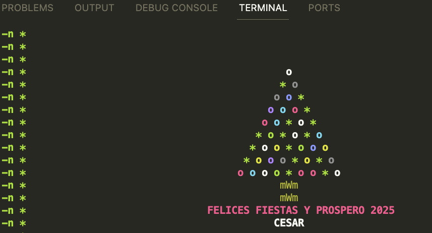

# Christmas Tree

## Table of Contents

- [About](#about)
- [Getting Started](#getting_started)
- [Usage](#usage)


## About <a name = "about"></a>

This shell scripts shows and interactive christmas tree in console

## Getting Started <a name = "getting_started"></a>

These instructions will get you a copy of the project up and running on your local machine for development and testing purposes. See [deployment](#deployment) for notes on how to deploy the project on a live system.

### Prerequisites

In this case you only need to have a (CLI or command interpeter) based on linux SO
```
sudo ./christmas.sh
```

## Usage <a name = "usage"></a>

Only for funny purposes

The result 

